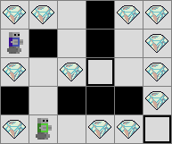

# Adversarial Search - 2024

## Description

This project focuses on implementing adversarial search algorithms, including **Minimax**, **Alpha-Beta Pruning**, and **Expectimax**, to create an agent that competes against another in a map-based game environment. The objective is for the agent to outmaneuver its opponent by collecting gems and finding the exit first. For further details, refer to `./pdf/consignes.pdf`.

<p align="center">
  
  <br/>
  <strong>Instance of the Aversarial Search Problem, where agent must collect gems and find the exit to beat its opponent.</strong>
</p>

## Features

- **Algorithmic graph search approach**: Transforms the problem into a graph, with nodes representing "world states", and navigates through them using **Minimax**, **Alpha-Beta Pruning**, and **Expectimax**.
- **Visualization**: A visual demonstration of the search algorithms, where the agent moves according to the solution found by the algorithm.

## Usage

Make sure you have `Python >= 3.12` installed.


### Running the Project

1. Clone the repository:

   ```bash
   git clone https://github.com/Ant0in/Projet2-IA.git
   ```

2. Navigate to the project directory:

   ```bash
   cd Projet2-IA/
   ```

3. Install dependencies:
   
   ```bash
   pip install -r "requirements.txt"
   ```

4. Run the project on a grid `map1.txt`:

   ```bash
   python ".\main.py" ".\tests\map1.txt" --algo "minimax" --maxdepth 5
   ```

### Running Tests

To run the tests using Pytest (verbose):

   ```bash
   pytest .\tests\ -vvv
   ```

## License

This project is licensed under the **MIT License**. You are free to use, modify, and distribute this software.

## Acknowledgements

This project was developed for the Artificial Intelligence course `INFO-F311`. Special thanks to `Tom Lenaerts & Yannick Molinghen (ULB)` for their guidance and support.

